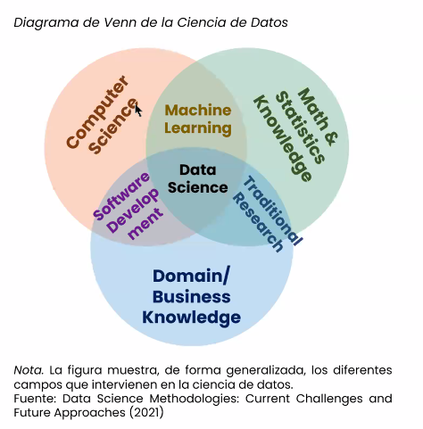
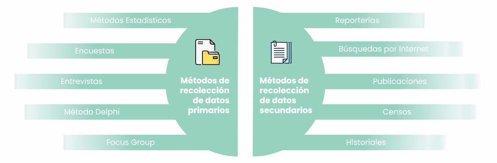
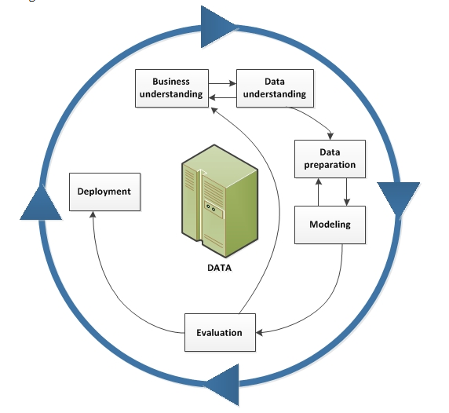
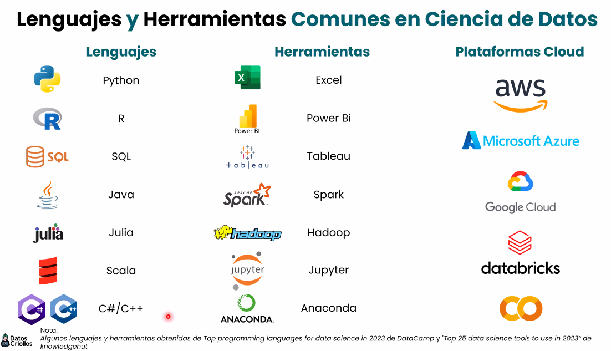

**Bootcamp en Ciencia de Datos con Python**

- [Sesion 1: Introduccion a la Ciencia de Datos](#sesion-1-introduccion-a-la-ciencia-de-datos)
  - [¿Que es la Ciencia de Datos?](#que-es-la-ciencia-de-datos)
  - [Recoleccion de Datos](#recoleccion-de-datos)
  - [Metodologia de Trabajo: *CRISP-DM*](#metodologia-de-trabajo-crisp-dm)
  - [Lenguajes y Herramientas Comunes en Ciencia de Datos](#lenguajes-y-herramientas-comunes-en-ciencia-de-datos)

# Sesion 1: Introduccion a la Ciencia de Datos
## ¿Que es la Ciencia de Datos? 
Es un campo interdisciplinario acerca de procesos y sistemas para extraer **conocimientos** o **insights** a partir de grandes volumenes de datos estructurados o no estructurados.

**¿Que campos lo conforman?** 
- Ciencias de la computación
- Estadística
- Matemáticas
- Conocimiento del caso (Entendimiento del negocio)
  

## Recoleccion de Datos
Proceso de reunir informacion o datos de diversas fuentes con el objetivo de almacenarlos, organizarlos y utilizarlos para diversos fines (analisis, toma de decisiones, investigacion, etc)

## Metodologia de Trabajo: *CRISP-DM*
1. Entendimiento del negocio:
   1. Investigacion del funcionamiento del negocio o comprecion del caso
   2. Conocer el impacto del modelo o analisis en el negocio o caso
   3. Conocer los objetivos tras el desarrollo de un modelo
   4. ¿Cual es mi poblacion, muestra, variable objetivo?
2. Entendimiento de la data:
   1. Realizar analisis de la calidad de datos
   2. Analisis descriptivo y exploratorio de datos, hallazgos de insights que ayuden a entender el comportamiento de nuestra variable objetivo
3. Preparación de la data:
   1. Alistar el dataset mediante la seleccion e inclusion de variables ya exploradas
   2. Transformacion de variables *(feature engineering)*
4. Modelamiento: 
   1. Ejecucion del algoritmo/modelo
   2. Hallazgo de drivers que aporten a la predictibilidad del comportamiento de la variable objetivo *(feature importance)*
   3. Interpretacion del modelo
5. Evaluacion: 
   1. Evaluacion del modelo mediante supuestos o validacion cruzada *(Teniendo en cuenta si es parametrico o no parametrico)*
   2. Tuneo de parametros *(para Machine Learning)*
   3. Estabilidad del modelo
6. Despliegue: 
   1. Plan de despliegue a produccion
   2. Preparacion de flujo de datos para la replica de prediccion *(pipelines)*
   3. Implementacion en una solucion de analitica avanzada
   4. Toma de decisiones

## Lenguajes y Herramientas Comunes en Ciencia de Datos

